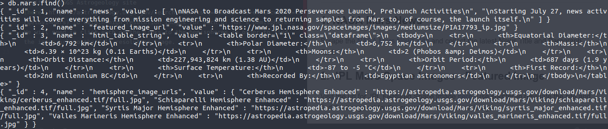
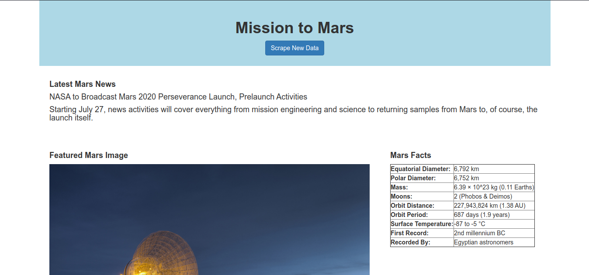
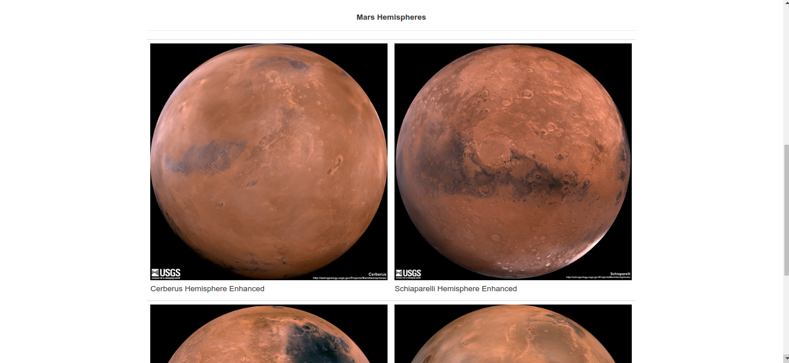

# Web Scraping Mini Project - Mission to Mars

In this project, I will build a web application that scrapes various websites for data related to the Mission to Mars and displays the information in a single HTML page. It outlines basic scraping techniques that can be used to automate information collection from across the internet. The web app is used to demonstrate how and end-to-end product might look like. The scraped data will be stored in a MongoDB instance to avoid tedious waits for the scraper to return each time the website is requested.

## What to scrape ?

### 1. NASA Mars News

Scrape the [NASA Mars News Site](https://mars.nasa.gov/news/) and collect the latest News Title and Paragraph Text.

### 2. JPL Mars Space Images - Featured Image

Visit the url for JPL Featured Space Image [here](https://www.jpl.nasa.gov/spaceimages/?search=&category=Mars).  Use splinter to navigate the site and find the image url for the current Featured Mars Image

### 3. Mars Facts

Visit the Mars Facts webpage [here](https://space-facts.com/mars/) and use Pandas to scrape the table containing facts about the planet including Diameter, Mass, etc.

### 4. Mars Hemispheres

Visit the USGS Astrogeology site [here](https://astrogeology.usgs.gov/search/results?q=hemisphere+enhanced&k1=target&v1=Mars) to obtain high resolution images for each of Mar's hemispheres.
We will need to click each of the links to the hemispheres in order to find the image url to the full resolution image.

## Flask App and MongoDB

Now that we have the information, lets establish a connection to mongofb on python using Pymongo and load the data. The mongo collection can be seen in the figure below
 
 

 
 
Lets create a basic webpage to serve the information to users in a visuallly appealing manner. Screenshot from the web app are attached below.
 
 

 
 

## What was used ?

* Selenium
* Splinter
* Pandas
* Pymongo
* Flask

## Conclusion

Scraping is a very essential tool in Data Science and Machine Learning. Data in real world applications dont come as condensed CSVs obtained from kaggle and must be obtained from a variety of sources. This project served as a good starting point to get familiar with the various techniques used to scrape data and store it into a much more friendlier NoSQL instance. 
